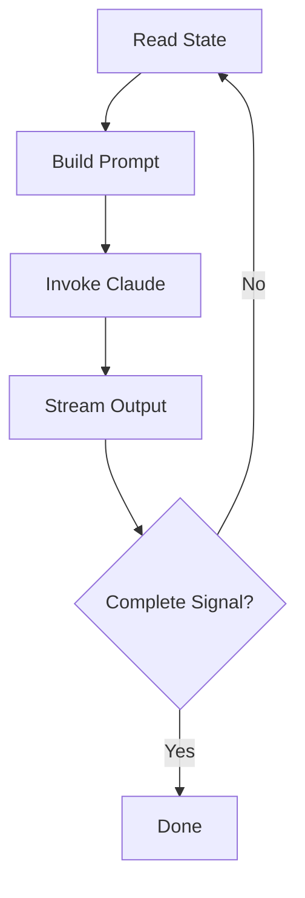

# The Ralph Loop

The Ralph Loop is Chief's execution model—a continuous loop that drives Claude to complete user stories.

::: tip Background Reading
For the full story behind this approach, see the blog post [Ship Features in Your Sleep with Ralph Loops](https://example.com/ralph-loops).
:::

## The Loop Visualized



## Step by Step

### 1. Read State

Chief reads the current state:
- `prd.json` - Which stories are complete, which are pending
- `progress.md` - What's been done so far
- Codebase - Current state of the code

### 2. Build Prompt

Chief constructs a prompt telling Claude:
- The current user story to implement
- Acceptance criteria to satisfy
- Context from previous iterations
- Instructions for signaling completion

### 3. Invoke Claude

Chief invokes Claude Code via the CLI, streaming output to the TUI in real-time.

### 4. Stream Output

As Claude works, Chief:
- Displays output in the TUI
- Logs everything to `claude.log`
- Watches for the completion signal

### 5. Check for Completion

Claude signals completion by outputting:

```
<chief-complete/>
```

When Chief sees this signal, it knows the story is done. It updates `prd.json` and moves to the next iteration.

## Iteration Limits

To prevent infinite loops, Chief has a configurable iteration limit (default: 100). If Claude hasn't completed after this many iterations, Chief stops and asks you to investigate.

## The Output Stream

Chief parses Claude's output in real-time using stream-json. This allows it to display progress while looking for the completion signal.

```
Claude: Writing tests for the new feature...
Claude: Tests passing, committing changes...
Claude: <chief-complete/>
Chief: ✓ Story complete, moving to next
```

## Why "Ralph"?

Ralph was the name of our first test PRD—a simple project that proved the loop works. The name stuck.
